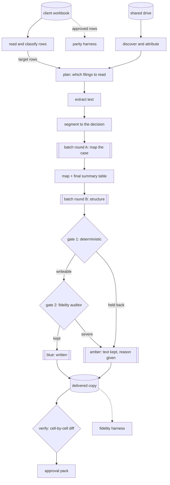

# judgment-summary-pipeline

Two thousand rows of a law firm's case spreadsheet, each needing one paragraph that says how the case ended. The documents are Brazilian court judgments, appellate rulings and settlement approvals, in Portuguese, scattered across a shared drive under whatever name somebody typed. The pipeline finds each case's filings, cuts them down to the part that decides the matter, reads them in two separate model calls so the second cannot invent what the first did not find, and then refuses its own work twice — once with a free deterministic check and once with an auditor that reads the summary back against the source. What survives is written into a **copy** of the spreadsheet, in blue. What does not is left for a human, in amber, with its text intact and the reason next to it. Rows a lawyer already signed off are never touched, and the delivered file is diffed cell by cell against the original to prove it.

 

**Status:** rebuilt in the open from a delivered engagement · **Runs offline:** yes, the demo needs no API key and makes no network call

```
$ npm run summarise -- inspect
caseload.xlsx — sheet "Carteira"
  summary column: D (index 4)
  rows with a recognisable case number: 27

  human-approved (never touched): 13
  already in house style: 14
  off-format text to replace: 6
  blank: 7

  rows the pipeline may write: 11
  gold standard for the parity harness: 11
  2 approved row(s) are NOT in house style — the gate cannot be stricter than the reviewers' own output

$ npm run summarise -- run
DEMO MODE — recorded readings from fixtures/recordings.json, sample case files from
fixtures/sources. No network call is made and nothing is billed.
stage 1/7 — extract
11 target row(s); extracting 11
  1000009-99.2099.8.26.0100: skipped digitalizacao.pdf (scanned)
  8 extracted, 0 already done, 3 without usable source, 0 failed
stage 2/7 — submit maps
  batch 1: 8 request(s) → msgbatch_fixture_map_001
stage 3/7 — collect maps
  8 map(s), 0 failed
stage 4/7 — submit structuring
  batch 1: 8 request(s) → msgbatch_fixture_structure_001
stage 5/7 — collect structuring
  8 result(s): 6 writeable, 2 for review, 0 invalid, 0 failed
stage 6/7 — audit
  6 summaries to audit
  refused: 1000007-77.2099.8.26.0100 — audit: a retenção de 20% indicada no resumo não
  consta da sentença, que fixa retenção de 10% sobre os valores pagos
  5 kept, 1 demoted, 0 audit call(s) failed
stage 7/7 — write
  5 written, 3 flagged
  verification: clean

total model cost: US$ 0.6205 · in 86344 / out 22477 (cache hit 33600)

$ npm run eval
fidelity: 5 sampled of 5 delivered — 0 severe, 1 minor
parity: 4 sampled of 4 approved — 1 equivalent, 1 more complete, 1 worse
```

The case files and the summaries are Portuguese because the court is; the code, the prompts, the console and the docs are English. Every case number, party, judge, comarca and amount in the fixtures is invented — see [Proving the fixtures are fictional](#proving-the-fixtures-are-fictional).

## The problem

A firm inherits a client's backlog: a spreadsheet with one row per case and a column that should hold a one-paragraph summary of how each case ended. Some rows are filled and marked green, meaning a lawyer wrote and approved them. Most are blank. A few hold somebody's note to themselves. The documents that would answer the question sit in a shared drive, sometimes one file per case named after the case, sometimes a folder named after the case holding files called `SENTENCA (2).pdf`, sometimes a single export of the whole docket, and sometimes not at all.

Three things make this harder than it sounds.

The **operative part prevails.** A Brazilian judgment argues at length and then decides in a paragraph beginning *Ante o exposto*. A summary built from the reasoning can say the opposite of the judgment. And the last decision governs: a first-instance ruling reversed on appeal must be reported as reversed, folded into one paragraph, not narrated twice.

**An invented figure is worse than a blank cell.** A retention percentage, an indexation index, a fee award — a client acts on these. A blank cell says "look it up". A confident wrong number does not.

**The green cells are somebody's work.** Overwriting one is not a defect that surfaces in a report; it is a lawyer's afternoon, gone silently, discovered weeks later.

## What it does

- **Finds the documents.** Attributes files to cases by the case number in the file name, then in the folder path, then by the twenty bare digits alone; reports the gain from each relaxation, because the gain is the finding. Picks up to two of each decisive kind, largest first, and records which it read and why.
- **Cuts the file down to the decision.** A judgment keeps its header, its report section and everything from the operative marker onward. A whole docket over sixty thousand characters becomes windows around every operative marker, merged where they overlap and trimmed from the *front*, so the governing decision always survives. A cut that removes less than a tenth is not made at all.
- **Reads in two calls.** Call one reasons freely over the case file and must end in a fixed summary table. Call two receives only that table and the rest of the map — never the case file — so it is physically unable to introduce a fact the map does not carry. Both rounds go through the Message Batches API at half price, chunked, with every batch id persisted before anything is awaited.
- **Refuses twice.** A free deterministic gate checks the house-style opening, catches a settlement with no terms, and believes the model whenever it says in prose that it could not tell. Then an auditor reads the summary back against the same segmented source and can demote, never promote.
- **Writes to a copy and proves it.** Blue for accepted, amber for held back with the text preserved, green cells untouched. The delivered file is then re-opened and diffed against the original, cell by cell: any change outside the summary column, or to any approved cell, fails the run.
- **Measures itself.** A fidelity harness re-audits the rows that were actually delivered. A parity harness generates summaries for the cases a lawyer already approved and has a judge compare them, reporting equivalent, more complete, worse and outright conflict separately.

## Architecture



`batch/runner.ts` is the seven stages and the only place they are sequenced; `batch/state.ts` is everything they write to disk, which is what makes a run that dies at hour three resume at hour three. The boundaries are interfaces with two implementations each: the batch client (Claude, recorded), the analyser, auditor and judge (Claude, recorded), the document store (folder, manifest, composite). `factory.ts` is the only module that picks between them, and the only module that branches on demo mode — via `config.demoMode`, since `config.ts` is the one place that reads `DEMO_MODE` from the environment.

## Design decisions

**Two calls, not one.** One call that reads a judgment and emits structured JSON has nothing stopping it from filling a required field with a plausible number. Splitting the work means the second call's entire input is the first call's output: every fact it writes is traceable to a line an auditor can check against the source. The cost is roughly double the tokens, which the batch discount halves back.

**A schema that does not demand answers.** Almost every field of the result has a default. Two do not — there has to be an outcome, and at least one claim. A schema that requires a judge's name is a schema that gets one invented, and inventing it into a typed field launders it into something that looks like data.

**The cheap gate first, and it is the only one that can let a row through.** Four questions answered by regex, with no model and no network, run on every row. The auditor costs a call per row and can only take rows away. Ordering them the other way would mean paying to audit rows a free check would have refused.

**The auditor fails open in production and fails closed in measurement.** In a run, an audit call that errors keeps the row: an outage must not silently turn a batch amber. In the fidelity harness the same failure scores as severe, because a number that could not be verified must never flatter the system. Both halves are in the code with the reason written next to them, because either one alone reads like a bug.

**Three guards on the approved cells, not one.** They are excluded when the target rows are chosen, refused again at the cell by a runtime check that re-reads the font colour, and the delivered file is diffed against the original afterwards. Partly-coloured rich-text runs are part of the check, because that is the shape a naive colour test misses.

**The house style was counted, not chosen.** Two wordings compete for a settlement. `npm run summarise -- style` counts them off the approved rows and declares the winner with its margin, and the prompt asks for that form. It also counts the approved rows matching *no* accepted opening, which is the honest ceiling on how strict the gate can be: a rule stricter than the reviewers' own output would refuse work they consider finished.

**Unpriced is a value.** A model with no entry in `src/model/pricing.json` reports `null`, and the reports print "unpriced". Falling back to a default model's prices produces a number that is wrong and looks right. The batch discount is part of the cost type rather than applied at a call site, so no caller can forget it.

**Reconnaissance is a command.** `inspect`, `coverage` and `style` cost nothing and answer the questions that decide whether a run is worth starting. They exist because the answers were surprising: most of the "missing" documents were a naming problem, and a large part of the workbook was already done.

## Running it

```bash
npm install
npm run summarise -- inspect        # what is in the workbook
npm run summarise -- coverage       # which rows have a document to read
npm run summarise -- style          # recount the house style off the approved rows
npm run summarise -- run            # the whole chain
npm run eval                        # fidelity and parity
```

Everything above runs offline against the fixtures. With no `ANTHROPIC_API_KEY`, demo mode is the default and the banner says so. For a real run, set the key and point the paths at real data:

```bash
export ANTHROPIC_API_KEY=...
export WORKBOOK_PATH=cases/caseload.xlsx
export SOURCE_DIR=cases/documents
npm run summarise -- stage extract      # each stage is separately runnable
npm run summarise -- stage map-submit
```

A production run waits hours between rounds, so `run` polls and each stage can also be run by hand across two days. Nothing is recomputed: a case whose summary was already accepted is never paid for twice. See [docs/DEMO.md](docs/DEMO.md) for what each fixture case is for, [docs/FLOW.md](docs/FLOW.md) for the stages and the state on disk, and [docs/GLOSSARY.md](docs/GLOSSARY.md) for the Brazilian procedural terms.

## Evaluation

Two harnesses run on every CI build, over the committed corpus.

**Fidelity** re-reads each delivered summary against the same segmented source the generator
saw, and asks an auditor to find assertions the source does not support. The population is the
rows that were actually *written* — a row the gate refused was never shown to anyone, so
counting it would let the system earn credit for work it declined to do.

| Measure | Value |
| --- | --- |
| Delivered rows, all sampled | 5 |
| No unsupported assertion | 100% |
| Severe: invented or contradicted | 0% |
| Mean fidelity score (0–10) | 9.6 |

**Parity** compares the pipeline against the rows a lawyer had already written and approved.
It has to generate its own summaries for those cases, because an approved row is excluded from
the target set by the first guard and so the pipeline never produces one otherwise.

| Measure | Value |
| --- | --- |
| Approved cases, all sampled | 4 |
| Same outcome | 75% |
| At least as good as the reviewer | 50% |
| In house style | 100% |
| Mean score (0–10) | 6.5 |

**And the gate outcomes themselves**, which is the number the whole design exists to produce:

| Outcome | Cases |
| --- | --- |
| Written | 5 |
| Held: a settlement whose terms are not in the file | 1 |
| Held: the file contains no final decision | 1 |
| **Demoted by the auditor after passing the cheap gate** | 1 |

**What these numbers are and are not.** The corpus is twelve synthetic cases written to force
twelve different branches, not a fifty-case golden set sampled from real work. So the tables
above measure *the pipeline's behaviour* — that the gates fire where they should, that the
auditor catches an invention the format check cannot see, that parity reports a loss when there
is one — and they are not a claim about how accurately a model reads real judgments. A 50%
"at least as good" is a deliberately unflattering fixture: one of the four approved cases is
built so the pipeline loses, because a harness that reports four wins is worth nothing.

## Cost and latency

| | |
| --- | --- |
| A full run over the corpus | US$ 0.6205 |
| The same run again, unchanged | US$ 0.0000 |
| The fidelity harness | US$ 0.1767 |
| The parity harness, judging | US$ 0.0267 |
| The parity harness, generating the summaries it judges | US$ 0.3852 |
| The parity harness, total | US$ 0.4119 |

The parity harness is split because it is the one bench that cannot reuse the pipeline's
output: approved rows are excluded from a normal run by the first guard, so it generates its
own summaries — two model calls per case — and discards them after scoring. That cost was
computed and thrown away with them, and the figure published here was the judge's alone,
fifteen times under the real one.

Both model rounds go through the Message Batches API, which bills at half the synchronous
price. The discount is part of the usage type rather than applied at a call site, so no caller
can forget it — the project this was rebuilt from applied it in one place and over-reported
everywhere else by a factor of two.

The second run costing exactly nothing is the resumability claim made literal, and CI asserts
it: every stage finds its own output already on disk, so re-running over an unchanged corpus
is free. A real backlog is paid for once.

**Latency is the trade.** A batch round takes minutes to hours, so a run is not interactive —
it is a job you start and collect. For a backlog of a few thousand cases that is the right
shape; for anything a person is waiting on, it is the wrong one.

Costs are computed from the usage the API reports, never estimated. A model with no entry in
`src/model/pricing.json` reports `null` and the reports print "unpriced", because a figure
produced by falling back to some other model's prices is wrong and looks right.

## Known failure modes

Five, and what the system does about each.

**A PDF with no text layer.** Detected by characters per page, reported, and left out. The case
stays blank rather than being summarised from nothing. A vision pass would fix it and is not
implemented.

**A case with no document at all.** Stays blank. A blank cell is the correct answer when there
is nothing to read, and the coverage report lists exactly which cases they are.

**A superseded decision in a long docket.** The segmenter keeps windows around every operative
marker and trims from the *front*, so the governing ruling survives the budget. A docket
trimmed from the other end would report a judgment that was reversed on appeal as if it still
stood — which is the worst failure this pipeline has, and the one the full-docket fixture
exists to pin.

**An invented figure that reads perfectly.** The cheap gate checks format, so a fluent summary
stating a retention of 20% where the judgment says 10% passes it. The auditor is the second
gate precisely for this, and the fixture corpus contains that exact row.

**The auditor itself failing.** In production an audit call that errors *keeps* the row, because
an outage must not turn a whole batch amber. In the fidelity harness the same failure scores as
**severe**, because a number that could not be verified must never flatter the system. Both
halves are in the code with the reason next to them, since either alone reads like a bug.

## How AI was used

**In the product:** two model calls per case, plus an auditor and a parity judge. The design is
that the second call never sees the case file — only the first call's map — so it cannot
introduce a fact that is not traceable to a line an auditor can check.

**In building it,** an AI coding assistant wrote first drafts of the modules and most of the
tests. What I wrote or rewrote is the part where being wrong has a consequence: the
segmentation budget and its front-trimming rule, the gate's four questions, the auditor's
fail-open/fail-closed asymmetry, the cost type with the batch discount built in, and the three
guards on reviewed cells.

**Rejected, concretely.** Three things I threw away or had to fix after they looked finished:

- A parity harness that compared the pipeline against the reviewer-approved rows — except an
  approved row is excluded from the target set by the first guard, so the pipeline never
  produces a summary for one and the comparison was against nothing. It now generates its own
  (`src/eval/generate.ts`) and throws them away after scoring.
- A batch collector that re-priced results it had already collected, so a resumed run doubled
  its own reported cost. `tests/demo.test.ts` asserts the second run costs exactly zero, and
  says why in a comment.
- A regex for "the model said it could not tell" that matched the singular *ilegível* and not
  the plural *ilegíveis*, so a summary admitting the documents were unreadable would have been
  written into the spreadsheet. Found by a test written to list the paraphrases, not by review.

**Validated:** every structured result passes a Zod schema before anything touches the
workbook, both gates run on every row, and the delivered file is diffed cell by cell against
the original. Commits were made with an AI assistant; attribution trailers are omitted and the
usage is documented here.

## Data and privacy

In production this pipeline reads court judgments, which in Brazil carry the personal data of
parties, lawyers and judges, and which may be under judicial seal. Three things follow.

The client's workbook is never written to — every run writes a copy and then proves the copy
differs only in the summary column. Rows a lawyer approved are protected three times over, and
the delivered file is diffed to show it. And the only text sent to the model is the segmented
source and the map derived from it: no spreadsheet column other than the case number, and no
client record of any kind.

This repository runs on fictional data only. See below.

## Proving the fixtures are fictional

A Brazilian case number carries two check digits computed over the rest of it (CNJ Resolution 65/2008, modulo 97 base 10). Every case number in this repository is dated **2099** and fails its own checksum, so it is not a number that can exist. This is checked, not asserted: the fixture builder refuses to run if any case number would be valid, and the test suite recomputes the digits for every row of the workbook.

Every party, lawyer, judge, comarca, court, company and amount is invented, and the fictional state is called Zetalândia. No CPF, CNPJ, OAB registration or contact detail appears anywhere, in the fixtures or in the prompts.

## Tests

```bash
npm test
npm run typecheck
npm run lint
```

The suite covers the deterministic gate hardest, because it is the function that decides what reaches a client. `tests/demo.test.ts` runs the whole chain on the committed fixtures and pins the outcome of every case: each fixture exists to force one branch, so a change that quietly stops a branch firing fails there. That is also the check that the fixtures are current — comparing committed binaries byte for byte across platforms proves nothing useful, while running them and checking what comes out proves the thing that matters.

## Built with

Node 24 with native type stripping, TypeScript, Zod 4, the Anthropic SDK (Message Batches API, prompt caching, structured output), ExcelJS, unpdf, vitest, and pdf-lib for the fixtures. Developed with an AI coding assistant.

## Licence

MIT — see [LICENSE](LICENSE).
